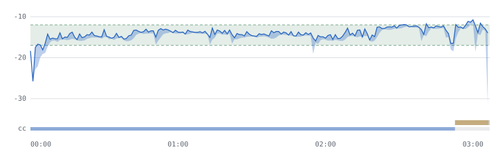

# Media Preflight

Drop in a finished audio or video file, pick where it is going, and get a
plain-English pass/fail report with the exact timestamps of everything that is
wrong — then, if you want, a corrected copy that is measured again from scratch
before it claims to be fixed.

No accounts. No uploads. No credits. No generative AI. MIT licensed.

It is an inspector with a small set of carefully bounded, previewable
transformations. It is not an editor, and it will not invent audio that was
never recorded.

```
Chapter 04.wav
23:41  wav  pcm_s16le 44.1 kHz mono 706 kbps

Target: Audiobook — ACX

✕ Not ready — the failures below would be rejected.
  4 failed, 1 warned, 11 passed, 2 not checked.

✕ RMS level: -29.89 dBFS                   Required: -23 to -18 dBFS
    measured across the whole file — there is no single moment to point at
✕ Peak level: -0.76 dBFS                         Required: ≤ -3 dBFS
    at 03:42 (peak -0.76 dBFS), 18:07 (peak -0.91 dBFS)
✕ Closing room tone: 0 s                          Required: 1 to 5 s
✕ Bitrate mode: vbr                                    Required: cbr
⚠ DC offset: 0.02                                   Required: ≤ 0.01

Problems occur at 03:42, 18:07, 41:16
```

## What it checks

**Loudness and level** — integrated loudness (ITU-R BS.1770), loudness range,
short-term excursions, true peak, sample peak, RMS, noise floor.

**Damage** — clipped samples with the seconds they occur in, DC offset, dead
channels, channel imbalance, out-of-phase stereo that will cancel in mono.

**Shape** — room tone at the head and tail, suspicious mid-file gaps, endings
that stop while the programme is still at full level.

**Picture** — black frames and frozen frames with the seconds they occupy,
flashing passages worth a human look, resolution, pixel format, telecine, and
whether the frame rate is constant or variable. Interlacing is *measured from
the picture*, not read off the header, because the header is a claim and on
this question it is often a false one — a telecined file will happily declare
itself progressive.

**Captions** — SubRip, WebVTT and Advanced SubStation, found as a sidecar
beside the media, extracted from an embedded stream, or checked on their own.
Overlapping cues, reading speed, line length and count, cues timed past the
last frame, impossible timings, and subtitle fonts this machine does not have.

**Captions against the audio** — and this is the one that saves the afternoon.
Everything above measures a caption file against itself. These measure it
against the programme: passages of sound nobody captioned, cues that play over
silence, and a constant offset between the two. Nobody scrubs a two-hour
recording to find the eleven seconds that were missed, and nobody notices a
file is a second and a half out of sync until a viewer says so.

**Declarations** — codec, container, sample rate, channel count, bitrate,
whether an MP3 is constant or variable bitrate, and whether an MP4's index
sits in front of its media or behind it. That last one costs a few seeks over
the box headers and decides whether anything can play before the whole file
has downloaded; YouTube's guide asks for it by name.

Every failure that can be tied to a moment carries one. Failures that are
whole-file measurements say so rather than pointing at a second that means
nothing.

### Do the captions match the programme?

```
⚠ Sound with no caption: 7 s                         Required: ≤ 0 s
    at 00:17 (7.0 s of sound with no caption)
⚠ Caption timing: 1.47 s                       Required: -0.4 to 0.4 s
```

The audio pass already measured where the sound is, so none of this costs a
decode. Three things fall out of comparing that against where the cues are:

**Sound nobody captioned.** The gaps *within* each stretch of sound rather than
the stretches as a whole — a twelve-second passage with three seconds of
caption on the front has nine seconds missing, and pointing at the whole
passage would be pointing at the three that are fine. Music and atmosphere are
legitimately uncaptioned, so this finds passages to look at rather than faults;
what it does is find them in a two-hour recording in seconds.

**A constant offset.** Every cue matched to the nearest moment sound starts,
and the median of those offsets taken. The median rather than the mean because
cues legitimately sit mid-sentence and one of those should not become the
answer, and it carries a confidence figure because a file where only a third of
cues matched anything has not really been measured.

**Cues playing over silence** — what drift looks like from the other end.

The chart grows a caption track underneath, so the gap is a thing you see
rather than a line you read:



## The shape, not just the list

A list of timestamps tells you to look at 18:07. It does not tell you that
18:07 is one of nine identical spikes and the real problem is a compressor
doing something odd. So the report draws the loudness too — in the window, in
the terminal, and as a chart written beside the client-facing report:

```
  loudness -12 to -27 LUFS, target -24 to -22
  ▇███▇▆▁▇███▇▆▁▇████▆▁▆████▆▄▆████▆▅▃████▇▅▃▇████▅▂▇████▅▃▇
   ✕✕✕✕✕✕✕✕✕✕✕✕✕✕✕✕✕✕✕✕✕✕✕✕✕✕✕✕✕✕✕✕✕✕✕✕✕✕✕✕✕ ✕✕✕✕✕  ✕✕✕✕✕
  00:00                                                01:30
```

The chart is bucketed — no display has 36,000 pixels for a ten-hour audiobook
— and each bucket keeps its **loudest and quietest** value rather than an
average. Averaging is precisely the operation that hides a spike next to a
hole, and spikes next to holes are what this tool is for; the drawn band
between the two shows how much the reduction is hiding.

A target band is shaded only when the target states its requirement in the
same unit the chart is drawn in. ACX asks for an RMS level, which is not LUFS,
so on that target no band appears and the chart says why.

In the window, hovering a finding lights only the marks that finding put on the
chart, so "at 18:07" and the shape at 18:07 are visibly the same fact.

**Chapters.** A file with chapter markers gets a per-chapter table, and the one
that is eighteen decibels louder than its neighbours is impossible to miss.
It reports the loudest short-term loudness in each chapter, not integrated
loudness: integrated is gated over a whole programme and cannot be re-derived
per chapter from per-second values. The first three seconds of each chapter are
excluded, because a short-term reading looks three seconds back and would
otherwise report the previous chapter's level as this one's.

## Targets

| id | what it is | thresholds |
| --- | --- | --- |
| `acx` | Audiobook, ACX retail delivery | published |
| `ebu_r128` | Broadcast, EBU R 128 | published |
| `spotify_podcast` | Podcast delivery to Spotify | published |
| `youtube` | YouTube upload | published |
| `social_vertical` | Instagram / TikTok | **informal** |
| `web` | Generic web video | **informal** |
| `subtitles` | Caption readability, on its own | **informal** |

`spotify_podcast` is **informal** for the reason given below, despite its
number being a published one.

Four of these are marked *informal* because there is no published
specification to point at: two platforms that document nothing, a set of
subtitling conventions reasonable people disagree about, and Spotify — whose
−14 LUFS figure is published for *music playback normalisation* and not as a
podcast delivery requirement, which Spotify does not publish at all.

Provenance is recorded per rule, not per profile, because within one target
some numbers are published and some are not. YouTube documents its encoding
settings and states no loudness figure anywhere; the −14 LUFS everybody quotes
is measured behaviour. So a finding on a threshold that is not from a
specification says so before it says anything else:

```
Integrated loudness: (measured behaviour, not a published figure.) YouTube's own
  encoding guide states no loudness figure; -14 LUFS is what its
  normalisation is measured to do.
```

Every published number in this tool has been read against its source document,
and the reading changed three of them. ACX's own page says *"We recommend
between 1 and 5 seconds of room tone at the beginning and end of each file"* —
the 0.5-to-1-second opening that appears in a great deal of guidance elsewhere
is on no ACX page, so the opening band is now 1 to 5 seconds and warns rather
than failing, because the page says *recommend*. YouTube's guide is explicit
that interlaced content must be deinterlaced before uploading, so that check
now fails instead of warning. Spotify asks for true peak below −2 dBTP when a
master is louder than −14 LUFS, which is now the warning band inside the −1
dBTP limit. Those thresholds are the widely reported figures, offered as a
sanity check you should adjust — not as a promise about what the platform does
today. Every profile carries the source its numbers came from and the month
they were read, and the report prints both.

You can write your own: see [PROFILES.md](PROFILES.md). A target is a
JSON file, not a patch to this tool.

## Requirements

- Python 3.10 or newer — standard library only, no packages to install
- ffmpeg and ffprobe, built with the `ebur128` filter
  (`brew install ffmpeg`, `winget install Gyan.FFmpeg`, `apt install ffmpeg`)

The tool probes for the filter rather than trusting the first ffmpeg on PATH,
because slim distribution builds omit it and the failure otherwise appears
halfway through an analysis as an unexplained filtergraph error.

## Build something you can double-click

```sh
./build.sh
```

Three things land in `build/`:

| | what it is |
| --- | --- |
| `Media Preflight.app` | a macOS bundle — drag it to /Applications |
| `media-preflight.pyz` | a single 88 KB archive that runs anywhere with Python |
| `media-preflight.desktop` | a Linux launcher for `~/.local/share/applications/` |

**What the build does not do is bundle a Python or an ffmpeg, and that is a
decision rather than an omission.** Bundling Python means taking a build-time
dependency — PyInstaller or py2app — on a tool whose entire claim is that it
needs nothing installed, and everybody who then wanted to build it would need
that dependency too. Bundling ffmpeg means shipping eighty megabytes and
inheriting a licensing decision that belongs to whoever redistributes it.

So the bundle removes the terminal, not the prerequisites. It looks for a
Python and an ffmpeg, and when it cannot find one it says which is missing and
prints the command that installs it, in a dialog rather than into a log nobody
opens. That is the honest version of "double-click to run" for a program that
is, underneath, a front end to ffmpeg.

The app has no terminal behind it to press Ctrl-C in, so the page it opens
carries a **stop Media Preflight** button that shuts the server down and leaves
nothing running.

The icon is drawn by `tools/icon.py`, which is a PNG writer and a rasteriser in
a hundred lines of standard library. An icon is a rounded square and two
strokes; that does not justify an imaging dependency, and a build that pulls
one in is a build somebody cannot run.

## Use it

**The window.** Double-click the built app, `Start Media Preflight.command` on
macOS, `start.bat` on Windows, or:

```sh
python3 app.py
```

This opens a page in your browser served from `127.0.0.1`, with a token minted
at startup so nothing else on the machine can drive it. Your file is never
uploaded; a browser cannot tell a local program where a dropped file lives, so
the page asks the tool to open your system's own file dialog and the path never
leaves the machine.

**The command line.**

```sh
python3 preflight.py check finished.mp3 --target acx
python3 preflight.py check episode.mp4  --target youtube
python3 preflight.py check film.srt     --target subtitles
python3 preflight.py batch chapters/    --target acx
python3 preflight.py fix   finished.mp3 --target acx --dry-run
python3 preflight.py fix   finished.mp3 --target acx
python3 preflight.py targets
```

Captions are found without being asked for: a sidecar beside the media first,
then an embedded subtitle stream. `--captions path.srt` overrides both, and a
caption file given on its own is checked on its own, with no media required.

`check` exits 0 when the file passes, 1 when it fails, and 2 when the tool
itself could not run — so it drops into a build script without parsing
anything. `--strict` makes warnings count as failures. `--json` and
`--markdown` write the machine-readable report and the client-facing one;
`--markdown report.md` also writes `report.loudness.svg` beside it and
references it, because almost everything that renders Markdown strips an
inline `<svg>` and a picture that silently fails to appear is worse than one
that is plainly a separate file.

### Interlacing, measured rather than believed

The obvious implementation reads `field_order` from the container and believes
it. That passes a 3:2-pulldown file whose header says `progressive` and whose
picture is full of repeated fields — which is most telecined material in the
world.

The obvious *second* implementation runs ffmpeg's `idet` and believes that
instead. It is worse. On progressive material with hard vertical edges and fast
motion — animation, screen recordings, test patterns — `idet` reports the
majority of frames as interlaced. A synthetic pattern here reads 42 frames
top-field-first and 25 bottom-field-first out of 75, and is not interlaced at
all.

What separates the two is that genuinely interlaced material is
*overwhelmingly one field order*, and the false positives are mixed, because
they are noise rather than field dominance. So two things must hold before this
tool says a file is interlaced: enough of the decided frames look interlaced,
**and** one field order clearly dominates. Material that passes the first test
and fails the second is reported as inconclusive — which is the truthful answer
and not a verdict.

Where the header and the picture disagree, that disagreement is its own
finding, because whichever of the two is wrong, something downstream will
believe the header.

None of this costs a decode: `idet` joins the filter chain the picture pass
already runs.

## Checking a delivery, not a file

Almost nothing anybody delivers is one file. An audiobook is thirty chapters
and ACX accepts or rejects the *title*; a podcast season is a folder.

```sh
python3 preflight.py batch chapters/ --target acx
```

Some requirements are properties of the set and of no member of it. ACX asks
that every file in a title share a channel count and a sample rate — and a rule
written against one file cannot say that. A title where chapter nine is stereo
and everything else is mono passes thirty individual checks and is rejected on
submission:

```
5 files — Audiobook — ACX

✕ Not ready — the failures below would be rejected.
  0 of 5 files fail, 0 warn; the delivery itself has 1 failure and 1 warning of its own.

Across the delivery
  ✕ Channel count across the title: 2 different: 1, 2  Required: ≤ 1
      chapter-04.mp3
  ⚠ Loudness spread across the title: 4 dB          Required: ≤ 3 dB
      chapter-03.mp3

Files
  ✓ chapter-01.mp3                             00:14  -22.8 dBFS RMS
  ✓ chapter-02.mp3                             00:14  -22.8 dBFS RMS
  ✓ chapter-03.mp3                             00:14  -18.8 dBFS RMS
  ✓ chapter-04.mp3                             00:14  -22.8 dBFS RMS
  ✓ chapter-05.mp3                             00:14  -22.8 dBFS RMS
```

Every file passes. The delivery does not.

Three details that decide whether the report is worth reading:

**It names the file to fix, not the two extremes.** When four chapters agree
and a fifth is four decibels up, the quietest of the four is not at fault — it
is the reference. Files further from the middle of the set than half its spread
are named; when that describes nobody, as in a smooth ramp, both ends are.

**Chapter 2 comes before chapter 10.** A delivery is ordered, and a report that
lists chapter 10 second is one somebody has to re-sort in their head.

**The tool's own output is never swept back in.** A folder checked twice would
otherwise start checking its own corrected copies.

**A missing chapter is visible from the filenames.** `chapter-01, -02, -04` is
a delivery short one file, and nothing about any file in it is wrong — which
is exactly the sort of thing found at submission rather than at export. Only
what actually looks like a sequence is checked: three or more files sharing a
prefix, a suffix and a digit width, because a folder of unrelated names has no
sequence to be missing from and inventing one would produce a finding about
nothing.

Files it cannot read are reported rather than fatal — one broken file in thirty
should not cost you the other twenty-nine — and the window has the same view,
where clicking a row opens that file's own report.

### Correcting a delivery

```sh
python3 preflight.py batch chapters/ --target acx --fix
```

Correcting each file on its own is exactly what does not fix a set. Every
chapter above is inside ACX's band; run the single-file `fix` over all five and
nothing happens, because nothing is wrong with any of them.

So the delivery decides what its files should agree on, and each file is
corrected to that:

```
  · 4 of 5 files are 1 channels; the rest are brought to match.
  · Every file is brought to -20.5 dBFS RMS, the middle of what this target
    asks for — not to the average of the files, which would satisfy the set
    and fail the target.
```

The majority decides the format questions, because a title is almost never
wrong in the majority — one chapter exported with the wrong preset is the shape
this fault actually takes. The **level** is decided by the target's band rather
than by the majority: bringing four quiet chapters up to meet a loud fifth would
satisfy the set rule by making every file wrong.

Then the same four promises as a single file, applied to a set:

```
Verification — the corrected delivery, measured from scratch:

  ✕ → ✓  Channel count across the title: 2 different: 1, 2 → 1
  ⚠ → ✓  Loudness spread across the title: 4 dB → 0.27 dB
```

The rebuilding matters more here than it does for one file. A stereo chapter
downmixed to mono comes back at a level the plan could not have predicted,
because how much a downmix costs depends on how alike the two channels were.
The tool measures what it wrote, finds that chapter off target, and builds it
again **from its source** — so however many rounds it takes, the number of
lossy encodes stays at one.

The window does the same thing through the same function, because a window that
quietly skipped the rebuilding would be making a weaker promise than the
command line.

## What costs a decode

The audio measurements come out of one pass. The picture measurements come out
of one more, and only when the target actually asks a question about the
picture — decoding a ninety-minute film to count black frames is minutes of
somebody's time, and a podcast profile has no reason to spend them.

Two things earn a pass of their own, each on a condition: locating peaks and
clipping, when the whole-file peak says a peak problem can exist at all; and
loudnorm's own measurement, because it will not accept another filter's
figures.

## The corrected copy

`fix` never touches your file. It writes `yourfile.preflight.ext` beside it and
refuses to overwrite anything that already exists unless told twice.

Before it writes, it shows you the whole plan in sentences and the exact ffmpeg
command it will run:

```
  1. Trim 1.65 s off the front, leaving 0.75 s of room tone before the first word.
  2. Trim the ending to 18.148 s, leaving 3 s of room tone after the last word.
  3. Apply +10.81 dB of gain, moving RMS from -31.31 dBFS to about -20.50 dBFS;
     peak would land near -5.73 dBFS.
  4. Re-encode the audio as mp3, at 192 kbps, constant bitrate.
```

Three things make this more than a wrapper around `ffmpeg -af`:

**It will not create a fault while fixing one.** Raising a quiet recording by
eleven decibels raises its peaks and its DC offset by eleven decibels too. The
planner does that arithmetic in advance and adds a limiter or a high-pass to
the plan, where you can read it before anything runs — and says plainly that
the source was fine and the gain is what would have broken it.

**It measures the result rather than assuming it.** After the copy is written
it is analysed again from nothing, and the report you get is that measurement:

```
Verification — the corrected copy, measured from scratch:

  ✕ → ✓  RMS level: -31.31 dBFS → -19.39 dBFS
  ✕ → ✓  Closing room tone: 8.2 s → 3 s
  ✕ → ✓  Bitrate mode: vbr → cbr
```

**When it lands off target, it rebuilds from the source.** Trimming five
seconds of room tone off an ending changes the RMS the gain was calculated
from; a lossy encoder hands back peaks louder than it was given. Either way the
correction is recomputed and applied to the *original* file again, so however
many attempts it takes, the number of lossy encodes stays at one.

`--recipe out.json` writes what was done as JSON you can read, argue with, and
repeat by hand.

## What it will not do

- Edit, record, or arrange anything
- Publish anywhere
- Repair with generative models — no invented audio, ever
- Remove noise, de-ess, de-click, or otherwise change the recording's character
- Retime, rewrite or reflow captions — it reports them and leaves them alone
- Clear a programme for photosensitivity; the flashing check is a screening
  heuristic that finds passages to look at, and says so wherever it appears
- Ask you to sign in, upload, or spend a credit

Noise reduction in particular is deliberately absent. A noise floor above the
target is reported with the timestamp of nothing, because the answer is to
treat the room or re-record, and a tool that quietly ran a denoiser over an
audiobook would be doing something its owner did not ask for.

## Development

```sh
python3 -m unittest discover -s tests     # 294 checks, about thirty seconds
python3 scripts/make_fixtures.py          # build the test media from ffmpeg
./build.sh                                # the double-clickable builds
```

One of those checks reads `build.sh` and compares the modules it copies against
the modules that exist. A bundle missing a file fails at runtime, on somebody
else's machine, which is the worst place to find out.

Test media is generated, not committed: every fixture is built from ffmpeg's
own sources, so it weighs nothing in the repository and its definition reads as
a description of the fault it carries.

The parsers are tested against ffmpeg output recorded verbatim, so a change in
ffmpeg's output shape breaks a test rather than quietly filling a report with
dashes. The end-to-end tests run real files through the whole path and skip
with an install line when ffmpeg is absent.

## Layout

| file | what it does |
| --- | --- |
| `preflight.py` | the command line, and the runner everything else calls |
| `app.py` | the local server behind the browser window |
| `index.html` | the window |
| `probe.py` | what the file *says* it is — ffprobe, normalised |
| `analysis.py` | what the audio *contains* — one decode, every measurement |
| `video.py` | what the picture contains — black, frozen, flashing, frame rate |
| `captions.py` | SubRip, WebVTT and ASS, parsed and measured |
| `chart.py` | the loudness picture — reduced, then drawn as SVG or as one terminal line |
| `batch.py` | a whole delivery: discovery, ordering, and the properties of the set |
| `build.sh` | the .app, the .pyz and the .desktop, each verified after building |
| `tools/icon.py` | the icon, drawn with zlib and arithmetic |
| `checks.py` | the rule engine: measurements plus a target, in, findings out |
| `profiles.py` | the delivery targets, as data |
| `corrections.py` | planning, previewing, applying and verifying a fix |
| `report.py` | the same findings as terminal text, Markdown, and JSON |
| `platform_support.py` | finding ffmpeg, native file dialogs, per-platform paths |

## Licence

MIT. See [LICENSE](LICENSE).
